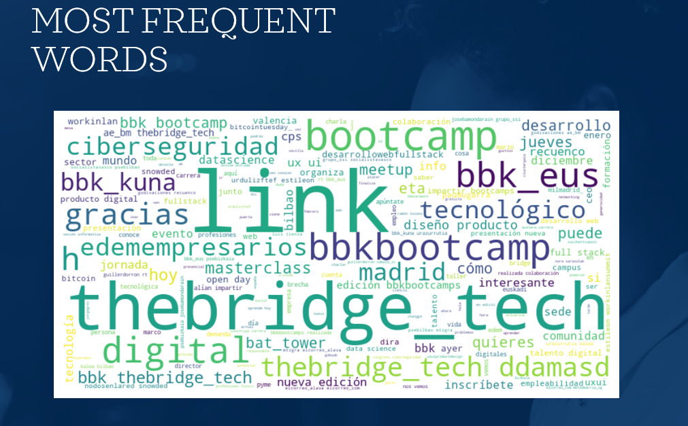

# @TheBridge Twitter-sentiment-analysis A NLP PROJECT
#### Twitter sentiment analysis for The Bridge School, data processing and predictions about simpathy. Database storaged on AWS. 
#### For full results, please consider this presentation [link to PowerPoint document](TWITTER%20SENTIMENT%20ANALYSIS.pptx)

Twitter sentiment analysis for The Bridge School, creating a database storaged on AWS. For full results, please consider this presentation [link to PowerPoint document](TWITTER%20SENTIMENT%20ANALYSIS.pptx)

## DATA SOURCE

Dowloaded using twitter API and python libraries like TWINT (before twitter/X api changes)

## NLP VISUALIZATIONS

### TOP TWEET 

### TOP USERS 

### WORD CLOUD

JARED RIVAS OBALLE. 
DATACOMPANY 2023

